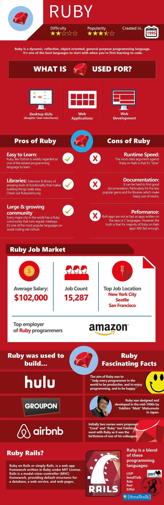

# zhengrr 所知的 Ruby

> 

[*Ruby*](https://www.ruby-lang.org/ "1995")

松本行弘

## 参考

*   [*Ruby-Doc.org*](https://ruby-doc.org/)

## 风格

*   [*The Ruby Style Guide*](https://github.com/rubocop-hq/ruby-style-guide) 
        [*cmn-Hans*](https://github.com/JuanitoFatas/ruby-style-guide/blob/master/README-zhCN.md) 

## 指南

*   [*Programming Ruby 中文版：第 2 版*](http://zbgb.org/278/ZdocDetail3691109.htm "ISBN 978-7-121-03815-0")

## Awesome

[*Awesome Ruby*](https://awesome-ruby.com/)

环境管理
| [*rbenv*](https://github.com/rbenv/rbenv),
  [*Ruby Installer*](https://rubyinstaller.org/),
  [*Ruby Version Manager*](https://rvm.io/)

包管理器
| [*RubyGems*](https://rubygems.org/)
| [*Bundler*](https://bundler.io/)

测试
| [*test-unit*](https://test-unit.github.io/)
| [*RSpec*](https://rspec.info/) 
      [*better*](http://betterspecs.org/),
      [*-cmn-Hans*](http://betterspecs.org/zh_cn/) 

集成开发
| [*RubyMine*](https://jetbrains.com/ruby/) 
      [*zh_CN*](https://github.com/pingfangx/jetbrains-in-chinese/tree/master/RubyMine) 

## 许可

项目采用 Unlicense 许可，文档采用 CC0-1.0 许可：

  
   
  To the extent possible under law,
  
    zhengrr
  has waived all copyright and related or neighboring rights to this work.

